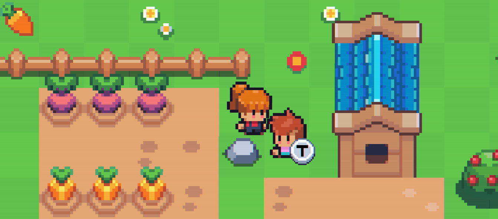

# Advanced CPP Project


## Playthrough

For a whole playthrough of the game you can click this [link](https://youtu.be/MBDc1ot5lMY).

Additionally we created a all-in-one `.exe`-file and have it ready on this [fileshare-link](https://fileshare.uibk.ac.at/f/770693c75efe4b1fbb4b/)

## Setup

### Miyoo Mini Plus

#### Play the game
First you will need OnionOS on your Miyoo Mini Plus. You can find the latest version on [GitHub](https://github.com/OnionUI/Onion/releases).

If you want to play the game on your Miyoo mini, go the Releases and download the latest `.zip`-file. Unpack the zip and place it on your SD card in the `App/` folder. 

You should then have a folder `App/JoannasAdventure` on your SD card.

Finally you can start the game by navigating to `Apps` folder and select Joannas Adventure (Normally you should find it at the bottom of the list).

Enjoy! :)

#### Build the game for Miyoo Mini Plus

To build the project for Miyoo Mini Plus, you can use the provided script:

```bash
./build_miyoo.sh
```

It uses podman to build the project in a container with the Miyoo Mini Plus [toolchain](https://github.com/shauninman/union-miyoomini-toolchain).


### Pull & Update vcpkg submodule

```bash
git submodule update --init --recursive
```

### CMake

CMake is required to configure and build this project.  
You’ll need **CMake ≥ 3.10** (newer recommended).

#### Windows

1. Go to: [https://cmake.org/download/](https://cmake.org/download/)
2. Download the latest **Windows x64 Installer (.msi)**.
3. During installation, **check** the box to “Add CMake to system PATH”.

#### Linux

##### Debian/Ubuntu

```bash
sudo apt install cmake
```

##### Fedora

```bash
sudo dnf install cmake
```

##### Arch/Manjaro

```bash
sudo pacman -S cmake
```

##### From Source

```
wget https://cmake.org/files/latest/cmake.tar.gz
tar -xvf cmake.tar.gz
cd cmake-*
./bootstrap && make && sudo make install
```

#### MacOS

Install with brew:

```bash
brew install cmake
```

### Additional Packages

```bash
sudo apt install \
    libxrandr-dev \
    libxcursor-dev \
    libxi-dev \
    libudev-dev \
    libfreetype-dev \
    libflac-dev \
    libvorbis-dev \
    libgl1-mesa-dev \
    libegl1-mesa-dev \
    libfreetype-dev
```

## Build

Before building, make sure you have a C++ compiler installed. You can use [Clang](https://releases.llvm.org/download.html), [GCC](https://gcc.gnu.org/install/) or [MSVC](https://code.visualstudio.com/docs/cpp/config-msvc) and follow their setup guide.

> **📝 Note on Building for Windows (Ninja + MSVC)**
> To successfully configure and build this project using Ninja, you must run your CMake commands from the **x64 Native Tools Command Prompt for VS 2022**. Standard Windows Command Prompt or PowerShell will fail because they do not have the MSVC C++ compiler (`cl.exe`) loaded into their environment path by default.

```bash
mkdir build && cd build
```

```bash
cmake --preset=default ..
cmake --build . --parallel
```

## Play

Start the game by executing the generated executable:

**Linux/MacOS**

```
./main
```

**Windows** (MSVC Compiler)

```
./main.exe
```

## Roadmap

## Specifications

- (2) Overworld with **3** different sections
  - Each with its own tone (architecture, sprites, music, enemies, …)
  - The second is only accessible after some story progress
  - Player can roam the world and interact with other entities
- (1) Characters
  - Player can talk to other characters
- (1) Resources / Inventory
  - Player can manage acquired resources through dedicated menus
- (1) Stats
  - Player's combatants have stats that influence the combat
  - Player's combatants get experience from combat, increasing their stats
  - Stats are influenced by equipment
- (3) Combat
  - Turn-based
  - Player selects which attacks, spells, items, etc. to use on which target
  - Enemies use attacks, spells, items, etc. to combat the player
  - _Game Over_ when all of player's combatants are dead
- (1) Save points
  - Player can save her progress at specific points in the game
  - Saved progress is persistent across play sessions (application termination)
- (1) Audio
  - Background music
  - Sound effects
- (1) Main menu
  - New game
  - Load game
  - Exit
- (2) Map
- (1) Minimap
